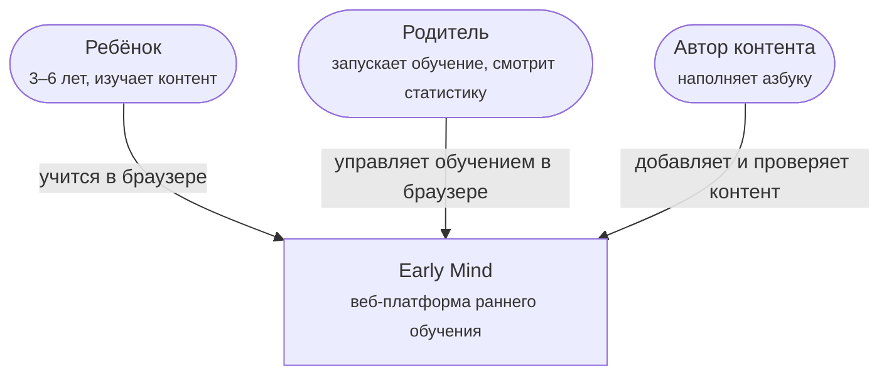
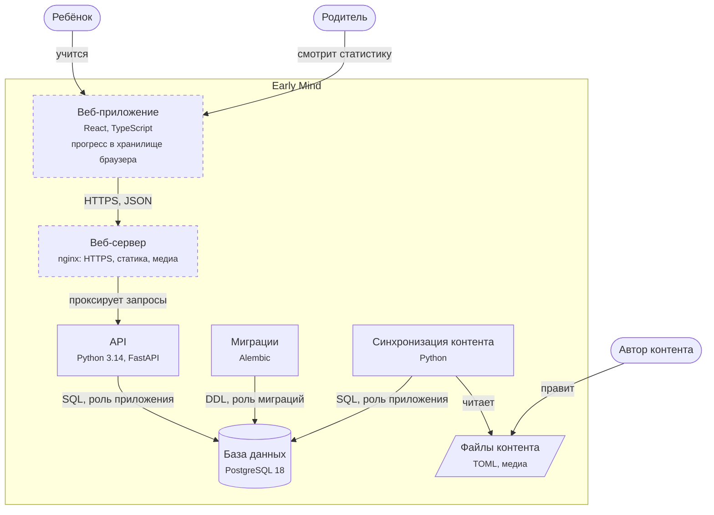

# Архитектура: модель C4

Архитектура описана по модели [C4](https://c4model.com/) на двух уровнях: контекст системы и контейнеры. Пунктирная рамка — элемент планируется, сплошная — реализован.

## Уровень 1. Контекст

| Элемент | Описание |
|---|---|
| Ребёнок | Изучает контент: карточки букв, обучение по порядку, проверочные задания |
| Родитель | Запускает обучение, смотрит статистику и историю занятий, подтверждает действия взрослого |
| Автор контента | Добавляет буквы, слова и медиа в файлы контента и проверяет их автоматическими тестами |

В релизе 1 у системы нет внешних зависимостей во время работы: контент хранится в собственной БД, а прогресс — на устройстве.

## Уровень 2. Контейнеры

| Контейнер | Назначение | Технологии | Статус |
|---|---|---|---|
| Веб-приложение | Интерфейс ребёнка и родителя. Хранит прогресс, статистику и историю сессий в хранилище браузера | React, TypeScript | Планируется |
| Веб-сервер | Отдаёт веб-приложение и медиафайлы, завершает HTTPS, проксирует запросы к API | nginx | Планируется |
| API | Отдаёт контент азбуки и проверки работоспособности по REST | Python 3.14, FastAPI, SQLAlchemy 2 | Реализовано. Буквы пока читаются из кода, переход на БД запланирован |
| База данных | Хранит контент: алфавиты, буквы, слова | PostgreSQL 18 | Реализовано |
| Миграции | Создают и изменяют схему БД под отдельной ролью | Alembic | Реализовано |
| Синхронизация контента | Загружает файлы контента в БД, повторный запуск безопасен | Python, SQLAlchemy 2 | Реализовано |
| Файлы контента | Источник правды для контента: буквы и слова в TOML, позже звуки и иллюстрации | TOML | Реализовано для букв и слов |

## Роли базы данных

| Роль | Права | Кто использует |
|---|---|---|
| `early_mind_app` | Чтение, добавление, изменение и удаление строк. Изменять схему не может | API, синхронизация контента |
| `early_mind_migrator` | Владелец таблиц, создаёт и изменяет схему | Миграции |

Права проверяются интеграционными тестами.

## Интерфейсы API

Полная спецификация OpenAPI доступна в Swagger UI по адресу `/docs`.

| Метод и путь | Назначение | Ответы |
|---|---|---|
| `GET /health` | Процесс API работает | 200 |
| `GET /health/ready` | API готов принимать запросы: БД доступна | 200, 503 |
| `GET /api/v1/alphabets/{alphabet_id}/letters` | Список букв алфавита в порядке позиции | 200, 404 |
| `GET /api/v1/alphabets/{alphabet_id}/letters/{letter_id}` | Буква со словами-примерами | 200, 404 |
