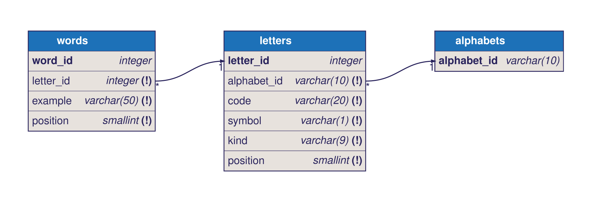

# Модель данных

## ER-диаграмма

Исходник диаграммы — [schema.dbml](schema.dbml). Стрелка ведёт от внешнего ключа к первичному: `letters.alphabet_id` → `alphabets.alphabet_id`, `words.letter_id` → `letters.letter_id`. `*` — много записей, `1` — одна запись, `(!)` — обязательное поле.

## Словарь данных

### alphabets — алфавиты

| Поле | Тип | Обязательное | Ограничения | Описание |
|---|---|---|---|---|
| `alphabet_id` | `VARCHAR(10)` | Да | Первичный ключ `pk_alphabets` | Код алфавита в API, например `ru` |

### letters — буквы

| Поле | Тип | Обязательное | Ограничения | Описание |
|---|---|---|---|---|
| `letter_id` | `INTEGER`, `GENERATED ALWAYS AS IDENTITY` | Да | Первичный ключ `pk_letters` | Внутренний идентификатор, в API не передаётся |
| `alphabet_id` | `VARCHAR(10)` | Да | Внешний ключ `fk_letters_alphabet_id_alphabets` на `alphabets.alphabet_id`, каскадное удаление | Алфавит, к которому относится буква |
| `code` | `VARCHAR(20)` | Да | Уникален в алфавите: `uq_letters_alphabet_id_code` | Код буквы латиницей для API, например `a`, `zh` |
| `symbol` | `VARCHAR(1)` | Да | — | Заглавная буква, например `А` |
| `kind` | `VARCHAR(9)` | Да | `ck_letters_kind`: `vowel`, `consonant` или `sign` | Вид буквы: гласная, согласная или знак |
| `position` | `SMALLINT` | Да | `ck_letters_position_positive`: больше 0. Уникальна в алфавите: `uq_letters_alphabet_id_position` | Позиция буквы в алфавите, начиная с 1 |

### words — слова-примеры

| Поле | Тип | Обязательное | Ограничения | Описание |
|---|---|---|---|---|
| `word_id` | `INTEGER`, `GENERATED ALWAYS AS IDENTITY` | Да | Первичный ключ `pk_words` | Внутренний идентификатор |
| `letter_id` | `INTEGER` | Да | Внешний ключ `fk_words_letter_id_letters` на `letters.letter_id`, каскадное удаление | Буква, которую иллюстрирует слово |
| `example` | `VARCHAR(50)` | Да | — | Слово-пример строчными буквами, например `арбуз` |
| `position` | `SMALLINT` | Да | `ck_words_position_positive`: больше 0. Уникальна для буквы: `uq_words_letter_id_position` | Порядок слова в карточке буквы |

Служебная таблица `alembic_version` хранит номер последней применённой миграции.

## Где хранятся данные релиза 1

| Данные | Где хранятся | Источник правды |
|---|---|---|
| Алфавиты, буквы, слова | PostgreSQL | Файлы контента в `content/alphabets`, переносятся в БД синхронизацией |
| Изученные буквы, статистика букв, история сессий | Хранилище браузера на устройстве | Веб-приложение |

## Планируемые изменения

- Контент: звук буквы, иллюстрации и озвучка слов, пояснения для Ъ и Ь.
- Релиз 2: аккаунты родителей, профили детей и прогресс на сервере.
