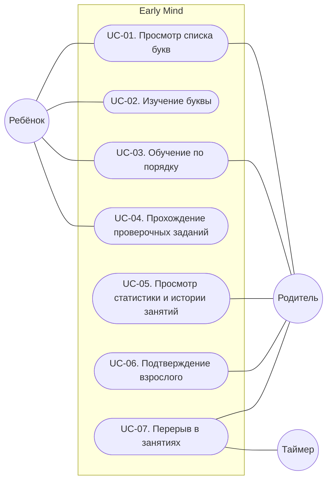

# Сценарии использования: релиз 1

## Акторы

| Актор | Описание |
|---|---|
| Ребёнок | Ребёнок 3–6 лет, изучает контент. Не умеет читать, поэтому все инструкции для него озвучены |
| Родитель | Запускает обучение, смотрит статистику, подтверждает действия взрослого |
| Таймер | Отсчитывает длительность сессии и запускает перерыв |

## Диаграмма

**Включение (include):** UC-03 включает UC-02 — каждая буква в обучении по порядку открывается в карточке. UC-05 и UC-07 включают UC-06 — просмотр статистики и продолжение после перерыва требуют подтверждения взрослого.

## Сводка

| ID | Сценарий | Основной актор | Приоритет |
|---|---|---|---|
| UC-01 | Просмотр списка букв | Ребёнок, Родитель | Must |
| UC-02 | Изучение буквы | Ребёнок | Must |
| UC-03 | Обучение по порядку | Ребёнок | Must |
| UC-04 | Прохождение проверочных заданий | Ребёнок | Must |
| UC-05 | Просмотр статистики и истории занятий | Родитель | Should |
| UC-06 | Подтверждение взрослого | Родитель | Should |
| UC-07 | Перерыв в занятиях | Таймер | Could |

## UC-01. Просмотр списка букв

**Акторы:** Ребёнок, Родитель.
**Цель:** найти букву и открыть её карточку.
**Предусловие:** нет.

**Основной сценарий:**

1. Актор открывает приложение.
2. Система показывает список букв и отмечает изученные (FR-01, FR-04).
3. Актор выбирает фильтр по виду букв.
4. Система озвучивает название фильтра и показывает только буквы этого вида (FR-02, FR-03).
5. Актор нажимает на букву.
6. Система открывает карточку буквы (FR-05). Выполняется UC-02.

**Альтернативные сценарии:**

- 3а. Актор не выбирает фильтр: отображаются все буквы, переход к шагу 5.
- 3б. Актор выбирает «Все»: система показывает все 33 буквы, переход к шагу 5.

**Постусловие:** открыта карточка выбранной буквы.

## UC-02. Изучение буквы

**Актор:** Ребёнок.
**Цель:** узнать, как буква звучит и выглядит.
**Предусловие:** открыта карточка буквы из UC-01 или UC-03.

**Основной сценарий:**

1. Система показывает заглавную и строчную букву и воспроизводит звук буквы (FR-06, FR-07).
2. Система отмечает букву изученной, если карточка открыта впервые (FR-12, BR-01).
3. Система показывает три слова-примера с иллюстрациями (FR-09).
4. Ребёнок нажимает на букву, система повторяет её звук (FR-08, FR-37).
5. Ребёнок нажимает на иллюстрацию, система озвучивает слово (FR-10, FR-37).

**Альтернативные сценарии:**

- 1а. Открыта карточка Ъ или Ь: вместо звука система озвучивает пояснение роли знака на паре слов, слова-примеры не показываются (FR-11). Переход к шагу 2.

**Постусловие:** буква изучена, статистика буквы обновлена (FR-24).

## UC-03. Обучение по порядку

**Актор:** Ребёнок. Обучение может запустить Родитель.
**Цель:** пройти буквы последовательно, не выбирая каждую.
**Предусловие:** открыт список букв, фильтр может быть выбран.

**Основной сценарий:**

1. Актор нажимает «Начать обучение».
2. Система открывает карточку первой по алфавиту неизученной буквы с учётом фильтра (FR-13). Выполняется UC-02.
3. Ребёнок нажимает «Дальше».
4. Система открывает карточку следующей по алфавиту буквы с учётом фильтра (FR-14). Выполняется UC-02. Шаги 3–4 повторяются.
5. После последней буквы система показывает экран завершения с предложением пройти проверочные задания (FR-15).

**Альтернативные сценарии:**

- 2а. Все буквы с учётом фильтра уже изучены: переход к шагу 5.

**Постусловие:** пройденные буквы изучены.

## UC-04. Прохождение проверочных заданий

**Актор:** Ребёнок.
**Цель:** закрепить изученные буквы.
**Предусловие:** есть хотя бы одна изученная буква, участвующая в заданиях (BR-07).

**Основной сценарий:**

1. Ребёнок открывает задания.
2. Система формирует задание по изученной букве: по звуку или по картинке (FR-16, FR-18, FR-19).
3. Система показывает три варианта ответа в случайном порядке и озвучивает задание (FR-17).
4. Ребёнок выбирает вариант.
5. Система засчитывает ответ (BR-02), озвучивает одобрение и переходит к шагу 2 (FR-20).

**Альтернативные сценарии:**

- 1а. Изученных букв для заданий нет: система предлагает сначала изучить буквы (FR-22). Сценарий завершается.
- 4а. Ребёнок выбрал неверный вариант: система озвучивает подсказку, подсвечивает верный вариант и воспроизводит его звук (FR-21). Переход к шагу 2.

**Постусловие:** статистика букв обновлена (FR-24).

## UC-05. Просмотр статистики и истории занятий

**Актор:** Родитель.
**Цель:** понять прогресс ребёнка и его экранное время.
**Предусловие:** нет.

**Основной сценарий:**

1. Родитель нажимает кнопку экрана для родителя.
2. Выполняется UC-06.
3. Система показывает число изученных букв из 33, списки сильных и слабых букв и статистику каждой буквы (FR-26, FR-27, FR-28).
4. Система показывает время занятий за сегодня и за последние 7 дней и последние 10 сессий (FR-29, FR-30).

**Альтернативные сценарии:**

- 2а. Подтверждение не пройдено: сценарий завершается.
- 3а. Прогресса нет: система показывает пояснение, как начать обучение (FR-31).

**Постусловие:** данные не изменены.

## UC-06. Подтверждение взрослого

**Актор:** Родитель.
**Цель:** подтвердить, что действие выполняет взрослый.
**Предусловие:** вызван из UC-05 или UC-07.

**Основной сценарий:**

1. Система показывает задание для взрослого: текстовый пример на умножение однозначных чисел (FR-33).
2. Родитель вводит ответ.
3. Система проверяет ответ и продолжает вызвавший сценарий (FR-34).

**Альтернативные сценарии:**

- 2а. Родитель закрывает задание: система возвращает экран, с которого вызвано подтверждение (FR-34).
- 3а. Ответ неверный: система возвращает экран, с которого вызвано подтверждение (FR-34).

**Постусловие:** подтверждение пройдено или отклонено.

## UC-07. Перерыв в занятиях

**Акторы:** Таймер, Родитель.
**Цель:** не допустить слишком длинной сессии.
**Предусловие:** идёт сессия (BR-08).

**Основной сценарий:**

1. Длительность сессии достигает 10 минут.
2. Система озвучивает предложение отдохнуть и показывает экран перерыва (FR-35).
3. Родитель нажимает «Продолжить».
4. Выполняется UC-06.
5. Система продолжает обучение с того же места (FR-36).

**Альтернативные сценарии:**

- 3а. Никто не нажимает «Продолжить»: экран перерыва остаётся, сессия завершается по правилу BR-08.
- 4а. Подтверждение не пройдено: экран перерыва остаётся.

**Постусловие:** сессия продолжена или завершена.
